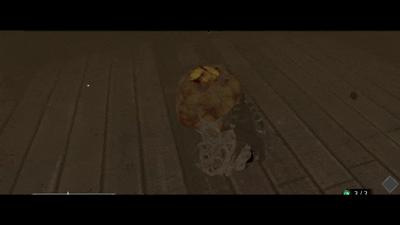
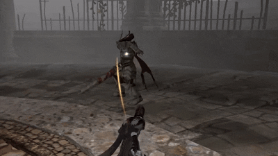
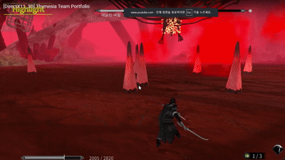
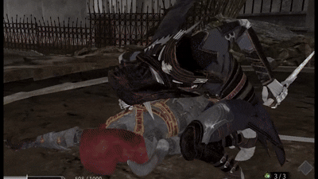
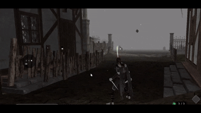
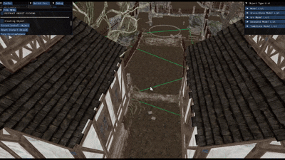

<!-- 기술 배지 -->

# Thymesia 팀 프로젝트 (DirectX11 기반 3D 게임)

## ■ 개요
- Thymesia는 액션 중심 다크 소율류 게임입니다.
- 팀원 6명 참여하였으며,
  저는 **맵툴 / 네비게이션 / 연출 / 상호작용 / 인스턴싱 / 아이템 시스템**을 담당했습니다.
- **C++ / DirectX11 / HLSL / ImGui 라이브러리, 자체 엔진으로 제작한 팀프로젝트 입니다.**

## ■ 개발 환경
- 언어: C++
- 개발 도구: Visual Studio, Windows API, DirectX 11, HLSL, ImGui 라이브러리, Fmod 라이브러리

## ■ 시연 영상
- [Thymesia 시연 영상](https://youtu.be/T3UJbHMiLYw)

## ■ 관련 링크, 작업 내용 및 코드
- [담당 파트 구현 내용 & 기술소개서 PDF](https://drive.google.com/file/d/17QnwDAURovJ5iqhc9QiynBnx4yU12BZQ/view?usp=drive_link)

## ■ 담당 프로젝트 구조

📂 **Client** └── 📂 **Private** 　　├── [DestructObject.cpp](./Client/Private/DestructObject.cpp)  
　　├── [SpecificObject.cpp](./Client/Private/SpecificObject.cpp)  
　　│　　├── [Chair.cpp](./Client/Private/Chair.cpp)  
　　│　　├── [ChairLamp.cpp](./Client/Private/ChairLamp.cpp)  
　　│　　└── [LadderObject.cpp](./Client/Private/LadderObject.cpp)  
　　├── [EnvironmentObject.cpp](./Client/Private/EnvironmentObject.cpp)  
　　├── [GroundObject.cpp](./Client/Private/GroundObject.cpp)  
　　├── [GameItem.cpp](./Client/Private/GameItem.cpp)  
　　├── [Button.cpp](./Client/Private/Button.cpp)  
　　├── [LockLine.cpp](./Client/Private/LockLine.cpp)  
　　└── GhostAisemy 관련 클래스 ([GhostAisemy.cpp](./Client/Private/GhostAisemy.cpp) / [GhostAisemy_AI.cpp](./Client/Private/GhostAisemy_AI.cpp))

📂 **Engine** └── 📂 **Private** 　　├── [Model.cpp](./Engine/Private/Model.cpp)  
　　├── [Mesh.cpp](./Engine/Private/Mesh.cpp)  
　　├── [Navigation.cpp](./Engine/Private/Navigation.cpp)  
　　├── [EdgeNavi.cpp](./Engine/Private/EdgeNavi.cpp)  
　　└── [Cell.cpp](./Engine/Private/Cell.cpp)

📂 **ShaderFiles** └── [Shader_VtxDestructMesh.hlsl](./ShaderFiles/Shader_VtxDestructMesh.hlsl)

---

## ■ 주요 구현 기능

### 1. Navigation 시스템 (맵툴 제작 및 플레이어 &  몬스터 & 보스 이동 가능 영역 처리 담당)
- **픽셀 피킹** 기반으로 셀 생성 (맵 툴에서 클릭한 위치를 월드 좌표로 변환합니다.)
- **정점 시계방향 교정**, 셀 인접 관계/경계선 판정 -> 향후 플레이어가 슬라이딩 벡터를 처리할 수 있게끔 합니다.
- 오브젝트가 **Navigation Cell 내부에서만 이동** 가능하도록 구현했습니다.
- **층간 이동** 구현(셀 y값 기반 위치 보정)하여, 사다리, 엘레베이터 등 더 넓은 맵의 위 아래 층 간 이동이 가능하게끔 했습니다.

### 2. Geometry Shader 연출
- **Idle 상태**에서 포자가 꿈틀거리는 연출을 사인파 기반 진동으로 구현했습니다.
- **피격 시 파편화**: 8방향 분할 + 고유 난수 방향 + 로드리게스 회전 적용하였습니다.
- **돌 파편 연출**: 중앙에서 원형 퍼짐, 상승 및 중력 기반 낙하를 적용해 구현했습니다.
- 
   

### 3. Item 시스템
- `아이템 매니져 클래스`를 기반으로 **아이템 등록 / 드롭 / 획득 / 복원** 기능을 통합 관리하였습니다. 
- **베지어 곡선 기반 아이템 드롭 궤적** 구현하여 처치 후, 아이템 드롭시 자연스러운 곡선이 그려지도록 구현했습니다.
- **아이템 렌더링 효과**: UV 흔들림 + 팽창/수축 애니메이션을 적용했습니다.
- **씬 전환 시 아이템 정보 복원 처리** -> 댕글링 포인터 문제 없이 깔끔한 씬 전환이 되게끔 처리했습니다.
- 

### 4. 상호작용 시스템
- **림라이트 셰이더 효과**로 상호작용 가능한 오브젝트라는 것을 강조했습니다.
- **Lock-On 시스템**: 플레이어 ↔ 몬스터 간 라인 연결 + UV 흐름으로 락온 상태에서 나오는 선을 구현했습니다.
- **상호작용 UI 버튼**: 월드좌표 → 화면 HUD 위치 변환 로직을 구현하여 상호 작용 시 알맞은 위치에 UI가 나타나게 했습니다.
- 

### 5. 메쉬 인스턴싱 + 컬링 최적화
- `인스턴싱 전용 오브젝트 클래스`를 기반으로 인스턴싱 구조 설계했습니다.
- 각 인스턴스의 월드행렬 → `VTX_MODEL_INSTANCE` 구조체로 GPU 전송합니다.
- 쉐이더에서 해당 인스턴스 데이터를 통해 월드 행렬을 재구성하여, 최종 위치와 회전을 적용합니다.
- 이후, **버퍼 생성 → 바인딩 → DrawIndexedInstanced() 호출**로 렌더링 최적화했습니다.
- **CPU 프러스텀 컬링**을 구현했습니다.(오브젝트에 씌어진 가상의 AABB박스 → 카메라 절두체 검사 → 컬링 선별 작업)
- 
---

## ■ 담당 파트 핵심 요약
- Navigation 셀 기반 맵툴 시스템
- Geometry Shader 기반 연출: 파편화, 파동 애니메이션
- 베지어 곡선 기반 아이템 드롭 시스템
- 림라이트 / Lock-On 상호작용 / UI 버튼 렌더링
- 인스턴싱 구조 및 프러스텀 컬링 최적화

---
